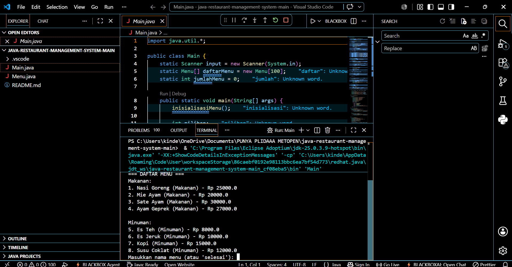
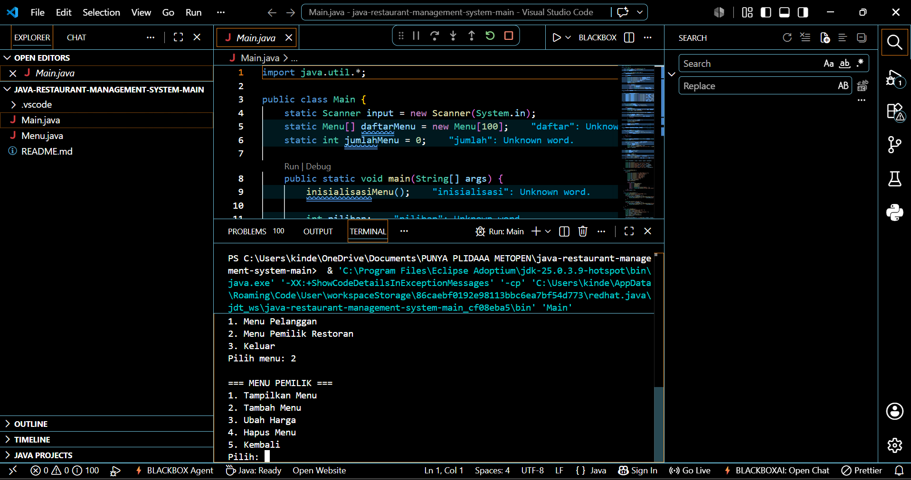
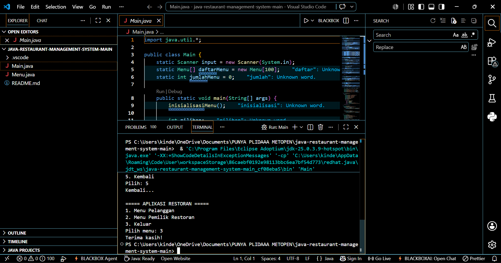

# 🍽 Restaurant Management System

A Java console application that simulates a simple restaurant management and ordering system. The application allows customers to place food orders while providing administrators with basic menu management features such as adding, updating, and deleting menu items.

This project was developed to strengthen understanding of Java programming fundamentals, Object-Oriented Programming concepts, and basic business logic implementation.

---

## 📸 Preview







---

## ✨ Features

### 👤 Customer Mode

* Display food and beverage menus
* Place multiple orders
* Validate menu selections
* Calculate order subtotal automatically
* Apply 10% tax
* Add service fee
* Apply discount for eligible orders
* Buy 1 Get 1 promotion for selected beverages
* Generate purchase receipt

### 👨‍💼 Admin Mode

* View restaurant menu
* Add new menu items
* Update menu prices
* Delete menu items
* Confirmation before update or delete actions

---

## 🛠 Tech Stack

| Technology    | Purpose              |
| ------------- | -------------------- |
| Java          | Programming Language |
| CLI (Console) | User Interface       |
| Arrays        | Data Storage         |
| Control Flow  | Business Logic       |

---

## 📂 Project Structure

```text
restaurant-management-system/
│
├── Menu.java
├── Main.java
└── README.md
```

---

## 🚀 Getting Started

Clone the repository.

```bash
git clone https://github.com/Plida05/<repository-name>.git
```

Compile the application.

```bash
javac Main.java
```

Run the application.

```bash
java Main
```

---

## 🧠 Key Concepts Implemented

* Java Fundamentals
* Object-Oriented Programming Basics
* Arrays
* Conditional Statements
* Loops
* User Input Validation
* Business Logic Implementation
* Console Application Development

---

## 🎯 Learning Objectives

This project was developed to practice:

* Java Programming Fundamentals
* Problem Solving
* Menu-Based Console Applications
* Data Processing
* Business Rule Implementation

---

## 👩‍💻 Author

**Rr Nabila Fatharani Yuwvrida**

Information Systems Student
